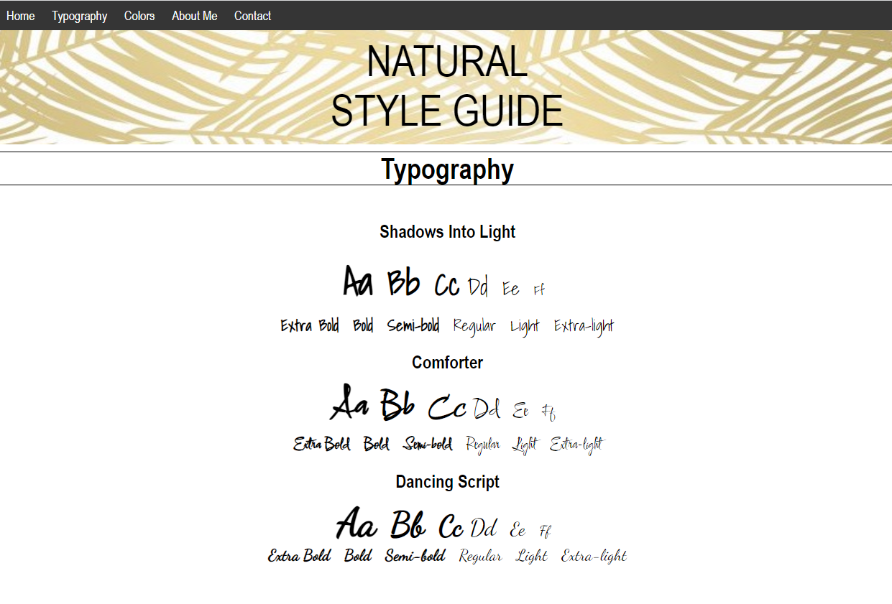

# NATURE STYLE GUIDE

## Introduction

This project was done as part of a Codecademy's project, I had to make a style guide on the theme of my choice, which was 'natural'. 

## General infos

In this project I made several sections:

* A nav bar at the top 
* A header with a background-image 
* The fisrt section with three typographies  
* The second section with three rows of circles, one for a blue color chart, one for a green color chart and the last for beige color chart. 
* The third section is about me 
* And finally a footer. 

  <kbd>
    
  </kbd>

  <kbd>
    
  </kbd>

  <kbd>
    
  </kbd>

## Host

Host by HOSTINGER  
At https://cindygraffin.com/

## Built with

*Visual Studio Code 
*HTML 
*CSS 
*Markdown

## Author

Graffin Cindy  
graffincindy@gmail.com